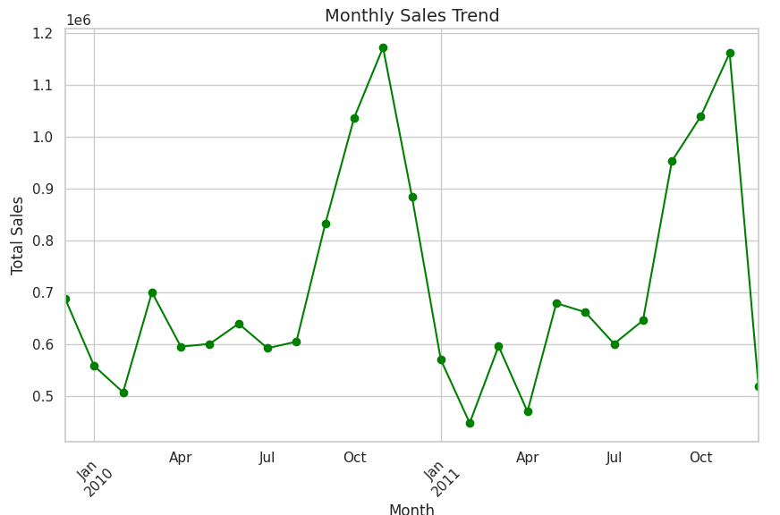
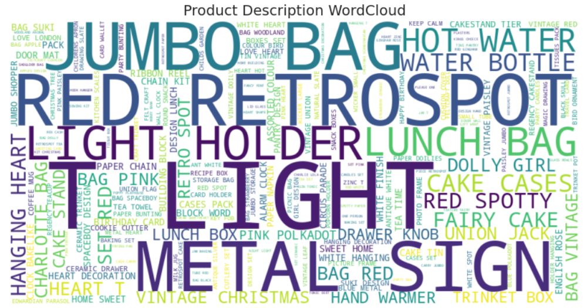
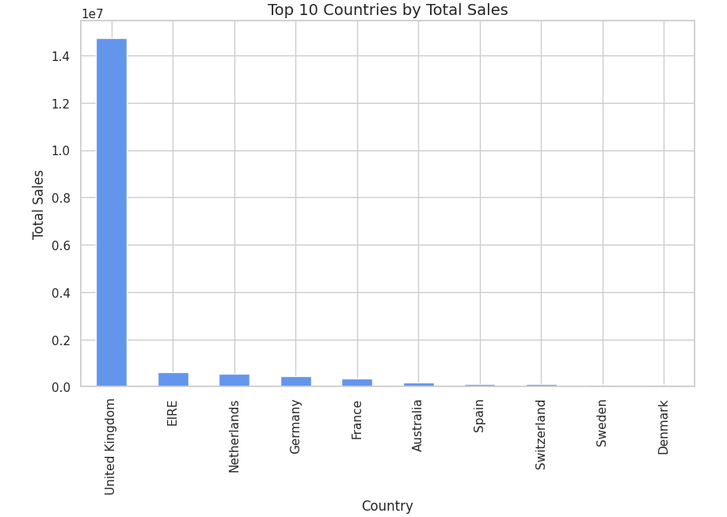

# 🛍️ Online Retail EDA Project (UCI Dataset)

### 📊 Overview

This project performs an **end-to-end Exploratory Data Analysis (EDA)** on the **Online Retail II (UCI)** dataset, which contains transactional data from a UK-based online store between **2009–2011**.
The goal is to uncover insights about customer behavior, sales trends, and product performance — and present actionable business recommendations.

---

### 🧰 Tools & Technologies

* **Python 3**
* **Pandas, NumPy** — data cleaning & manipulation
* **Matplotlib, Seaborn** — data visualization
* **WordCloud** — product description analysis
* **Datetime** — time-series exploration
* **Kaggle Notebooks** — implementation environment

---

### 🧩 Dataset Information

* **Source:** [Online Retail II (UCI)](https://www.kaggle.com/datasets/mashlyn/online-retail-ii-uci)
* **Rows:** ~1.06 million
* **Columns:** 8 (InvoiceNo, StockCode, Description, Quantity, InvoiceDate, UnitPrice, CustomerID, Country)
* Contains transactions for both **domestic (UK)** and **international** customers.

---

### 📈 Project Workflow

#### 🔹 Step 1: Import Libraries

Load essential Python libraries for analysis and visualization.

#### 🔹 Step 2: Load Dataset

Auto-detect and read the CSV file from Kaggle input directory.

#### 🔹 Step 3: Data Inspection

Use `.info()`, `.describe()`, and `.head()` to understand structure and summary stats.

#### 🔹 Step 4: Data Cleaning

* Handle missing values (especially in `CustomerID`).
* Remove negative quantities and zero unit prices.
* Replace infinite values with NaN to avoid warnings.

#### 🔹 Step 5: Feature Engineering

* Create **TotalPrice = Quantity × UnitPrice**
* Convert `InvoiceDate` to datetime format.
* Derive **Month**, **Day**, **Hour**, and **Year** features for trend analysis.

#### 🔹 Step 6: Exploratory Data Analysis (EDA)

* Top 10 countries by sales.
* Monthly sales trends & seasonal patterns.
* Top-selling products and product categories.
* Customer purchase frequency & revenue contribution.

#### 🔹 Step 7: RFM Analysis

Segment customers based on:

* **Recency** — last purchase date
* **Frequency** — number of purchases
* **Monetary** — total spending

Helps identify **loyal**, **at-risk**, and **lost** customers.

#### 🔹 Step 8: Visualization

Generate visual insights using:

* Bar charts, line plots, and heatmaps.
* WordCloud for most frequent product descriptions.
* Country-wise sales distribution.

#### 🔹 Step 9: Key Insights

**Observations**

* 🇬🇧 UK contributes ~85% of total sales.
* November–December shows strong seasonal spikes (holiday sales).
* Gift and decorative items dominate top-selling lists.
* RFM segmentation reveals valuable and at-risk customer clusters.

**Recommendations**

* Target high RFM-score customers with loyalty discounts.
* Focus marketing during peak months (Nov–Dec).
* Optimize inventory for top-selling categories.

---

### 📊 Sample Visuals

#### 1️⃣ Monthly Sales Trend


#### 2️⃣ Top 10 Products by Revenue


#### 3️⃣ RFM Customer Segmentation


#### 4️⃣ Country-wise Sales Distribution



---

### 🧠 Learnings

* Data cleaning and preprocessing of large real-world datasets.
* Time-series and customer segmentation analysis.
* Insight communication for business decision-making.

---

### 🧾 References

* UCI Machine Learning Repository — Online Retail Dataset
* Kaggle Notebook: [Your Kaggle Notebook Link Here]
* Author: [Your Name]

---

### 📌 Repository Structure

```
Online-Retail-EDA-Project/
│
├── online_retail_EDA.ipynb      # Main Kaggle notebook
├── README.md                    # Project documentation
├── requirements.txt              # Dependencies list
└── images/                      # screenshots of charts
```

---

